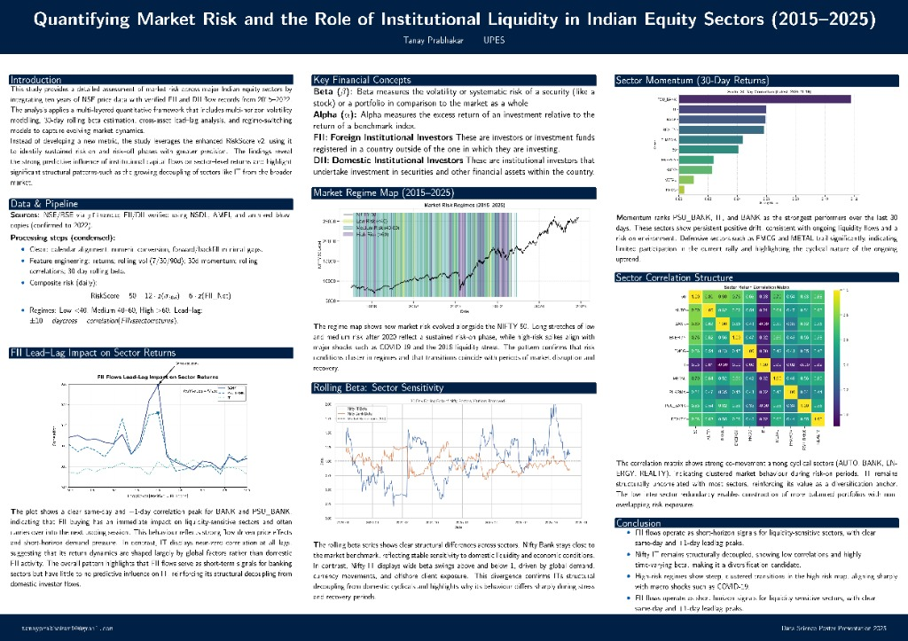

# Nifty Liquidity Report & Market Risk Analysis



This repository contains the code and data used to generate the "Quantifying Market Risk and the Role of Institutional Liquidity in Indian Equity Sectors (2015–2025)" report and poster.

## Project Overview
This study provides a detailed assessment of market risk across major Indian equity sectors by integrating ten years of NSE price data with verified FII and DII flow records. The analysis applies a multi-layered quantitative framework that includes:
- Multi-horizon volatility modelling
- 30-day rolling beta estimation
- Cross-asset lead–lag analysis
- Regime-switching models to capture evolving market dynamics

## Repository Structure
## Repository Structure
- **`src/`**: Contains all Python scripts (`collect_data.py`, `process_market_data.py`, etc.).
- **`data/`**: Stores all CSV data files.
- **`plots/`**: Stores all generated visualizations.
- **`run_analysis.py`**: Master script to run the entire pipeline.
- **`requirements.txt`**: Python dependencies.

## Setup & Usage

1.  **Install Dependencies**:
    ```bash
    pip install -r requirements.txt
    ```

2.  **Run the Analysis**:
    To generate all data and plots, simply run:
    ```bash
    python run_analysis.py
    ```
    
    This will:
    - Process the raw data (if available) or use the existing master file.
    - Generate the `master_market_data_2015_2022_final.csv`.
    - Create all visualizations in the current directory.

## Visualizations
The script generates several high-quality plots used in the report:
- `fii_leadlag_impact_300dpi.png`
- `market_risk_regimes_300dpi.png`
- `rolling_beta_30d_300dpi.png`
- `sector_momentum_30d_300dpi.png`
- `sector_correlation_matrix_300dpi.png`

## Data Sources
- **NSE/BSE**: Price data via `yfinance`.
- **FII/DII**: Verified flow records using NSDL, AMFI, and archived bhav-copies.

## Author
Tanay Prabhakar | UPES
